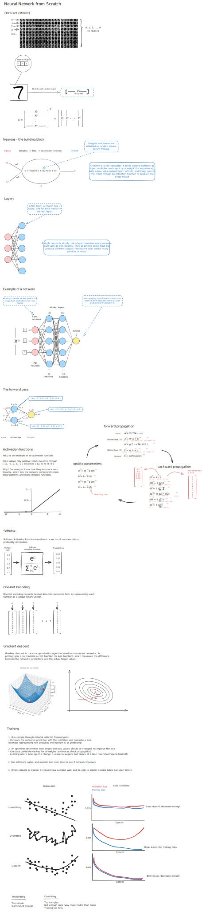

# 🧠 Neural Network from Scratch

This project implements a fully functional Neural Network **from scratch** using Python, without relying on high-level deep learning frameworks like TensorFlow or PyTorch.

---

## 📌 Project Overview

The goal of this project is to understand the core concepts behind neural networks by building everything manually, including:

- Forward Propagation
- Backpropagation
- Gradient Descent
- Activation Functions (ReLU, Softmax)

The model is trained on the **Digit Recognizer (MNIST)** dataset to classify handwritten digits (0–9).

---

## 📂 Dataset

Dataset used:  
👉 https://www.kaggle.com/c/digit-recognizer/data  

- **train.csv** – labeled training data  
- **test.csv** – unlabeled test data  

Each image:
- 28 × 28 pixels
- Flattened into 784 input features

---

## 🧠 Neural Network Architecture

Below is the architecture of the neural network used in this project:

---

## ⚙️ Features

- ✅ Built completely from scratch (NumPy only)
- ✅ Custom forward & backward propagation
- ✅ Softmax output layer for multi-class classification
- ✅ Gradient descent optimization
- ✅ No deep learning libraries used

---

## 🏗️ Project Structure
